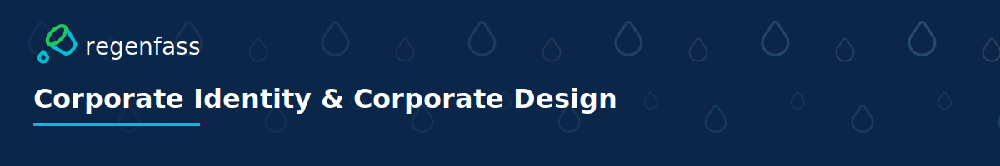

# README Header Graphic Usage Guide

This guide explains how to use the README header graphic in your repository's README.md file.

## Overview

The README header graphic is a banner image designed to be placed at the top of README.md files in Regenfass repositories. It provides consistent branding and visual identity.

## File Formats

The header graphic is available in two formats:

- **SVG** (`assets/readme-header.svg`) - Vector format, recommended for web display
- **PNG** (`assets/readme-header.png`) - Raster format, generated from SVG

## Dimensions

- **Width**: 1200px
- **Height**: 200px
- **Aspect Ratio**: 6:1

These dimensions are optimised for GitHub README display width.

## Adding to README

### Method 1: Using SVG (Recommended)

SVG format provides the best quality and scalability:

```markdown

```

### Method 2: Using PNG

If you prefer PNG format or need it for compatibility:

```markdown

```

### Method 3: Using Relative Path

If the header is in the repository root:

```markdown

```

### Method 4: Centred Display

To centre the header image:

```markdown
<div align="center">


</div>
```

## Complete Example

Here's a complete example of a README with the header:

```markdown
<div align="center">


</div>

# Repository Name

Repository description goes here...

## Installation

[Content continues...]
```

## Generating PNG Version

If you need to generate or regenerate the PNG version:

### Using npm/pnpm Script

```bash
pnpm generate:readme-header
```

This will generate `assets/readme-header.png` from `assets/readme-header.svg`.

### Using Node.js Directly

```bash
node scripts/generate-readme-header.mjs
```

### Custom Paths

```bash
node scripts/generate-readme-header.mjs \
  --input assets/readme-header.svg \
  --output assets/readme-header.png
```

## Customization

### For Other Repositories

If you want to customise the header for a different repository:

1. Copy `assets/readme-header.svg` to your repository
2. Edit the SVG file to change:
   - Title text (currently "Corporate Identity & Corporate Design")
   - Logo position or size
   - Decorative elements
3. Regenerate PNG if needed

### Design Guidelines

When customizing:
- The background is the waterline graphic (dark raindrop top, light blue water below; see `assets/backgrounds/waterline.svg`)
- Keep the logo visible and properly sized
- Ensure text is readable (white on overlay)
- Preserve the overall aesthetic and brand consistency

## Best Practices

1. **Use SVG when possible**: Better quality and smaller file size
2. **Place at the top**: Header should be the first visual element
3. **Include alt text**: Always provide descriptive alt text for accessibility
4. **Centre for impact**: Centring the header creates a more polished look
5. **Keep it updated**: Regenerate PNG if you modify the SVG

## Troubleshooting

### Image Not Displaying

- Check that the file path is correct
- Ensure the file exists in the specified location
- Verify the file is committed to the repository
- Check for typos in the markdown syntax

### Image Too Large/Small

- SVG will scale automatically to container width
- PNG dimensions are fixed at 1200x200px
- Adjust using HTML if needed: ``

### Quality Issues

- Use SVG format for best quality
- Regenerate PNG if it appears pixelated
- Ensure PNG is generated at full resolution (1200x200px)

## Technical Details

### SVG Structure

The SVG includes:
- Waterline background (from `assets/backgrounds/waterline.svg`: dark raindrop top, light blue water with waves below)
- Dark gradient overlay for text contrast
- Regenfass horizontal logo (aqua variant)
- Title text: "Corporate Identity & Corporate Design"

### Fonts

The SVG uses:
- **System UI font stack** (Bold, 700) for the title
- Fonts are referenced but may fall back to system fonts if not available

### Colours

- Background: Waterline graphic (dark blue #0B2649 top with raindrops, light blue water below)
- Overlay: Navy gradient for text contrast
- Logo accents: Aqua (#00BCD4)
- Text: White (#FFFFFF)

## Questions?

If you have questions about using the README header graphic, please refer to:
- [Logo Usage Guidelines](../guidelines/LOGO_USAGE.md)
- [Colour palette](../guidelines/COLOR_PALETTE.md)
- [Typography Guidelines](../guidelines/TYPOGRAPHY.md)

Or contact the designated maintainers listed in the CODEOWNERS file.
