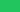
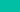
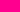
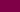

# Color Palette

## Brand Colours

The Regenfass colour palette consists of primary brand colours (Dark Blue, Green, Turquoise) and a complementary accent (Rose/Red) that work together for a consistent visual identity across all marketing and sales channels.

## Primary Colours

### Dark Blue


```text
Name: Dark Blue
HEX: #0B2649
RGB: 11 38 73
Pantone: 533 C
```

**Usage**: Trust, professionalism; primary dark backgrounds, headings, key brand elements

### Green



```text
Name: Green
HEX: #22C55E
RGB: 34 197 94
Pantone: 354 C
```

**Usage**: Energy, call-to-action; accents, highlights, interactive elements

### Turquoise


```text
Name: Turquoise
HEX: #00BCD4
RGB: 0 188 212
Pantone: 319 C
```

**Usage**: Clarity, innovation; secondary accents, links, supporting visuals

### Complement (Rose/Red)


```text
Name: Complement
HEX: #E11D48
RGB: 225 29 72
Pantone: 1925 C
```

**Usage**: Complementary accent; contrast to green, secondary CTAs, supporting highlights

## Colour Harmony and Shades

Colour shades and harmony rules provide additional variations for contrast and visual hierarchy. Use the [Adobe Color Wheel](https://color.adobe.com/create/color-wheel) with a base colour in HEX (Cyan/Turquoise, Green, or Dark Blue) to explore harmony rules.

### Analogous Harmony (Cyan #00BCD4)

Related harmony colours for Turquoise/Cyan:

- **#00BCD4** – Base Turquoise
- **#51F07F** – Light green
- **#AFD955** – Lime
- **#F0CF51** – Yellow
- **#E6934E** – Orange accent

Use for complementary palettes and secondary accents while keeping the base Turquoise as primary.

### Turquoise (#00BCD4) Shading

| HEX     | Usage / note        |
|---------|---------------------|
| #00C6E0 | Lighter variant     |
| #00BCD4 | Base                |
| #00B6CF | Slightly darker     |
| #00A4BA | Darker              |
| #004A54 | Dark for contrast   |

### Green (#22C55E) Shading

| HEX     | Usage / note        |
|---------|---------------------|
| #22C55E | Base                |
| #1DAA4F | Darker              |
| #17883F | Medium dark         |
| #0F5A2A | Dark                |
| #082D15 | Very dark           |

### Dark Blue (#0B2649) Shading

| HEX     | Usage / note        |
|---------|---------------------|
| #0B2649 | Base                |
| #206FD6 | Lighter blue        |
| #174E96 | Medium blue         |
| #0D2D57 | Darker              |
| #081A33 | Very dark           |

### Pantone (Screen Printing)

For consistent reproduction in print and industrial applications, use the Pantone Color System (CMYK Pantone + solid coated). Find in Illustrator:

- **Dark Blue:** Pantone 533 C
- **Green:** Pantone 354 C
- **Turquoise:** Pantone 319 C
- **Complement:** Pantone 1925 C

## Neutral Colours

### Dark Grey


```text
Name: Dark Grey
HEX: #333333
RGB: rgb(51, 51, 51)
CMYK: C:0 M:0 Y:0 K:80
```

**Usage**: Body text, dark UI elements

### Medium Grey


```text
Name: Medium Grey
HEX: #666666
RGB: rgb(102, 102, 102)
CMYK: C:0 M:0 Y:0 K:60
```

**Usage**: Secondary text, borders

### Light Grey


```text
Name: Light Grey
HEX: #CCCCCC
RGB: rgb(204, 204, 204)
CMYK: C:0 M:0 Y:0 K:20
```

**Usage**: Backgrounds, dividers, subtle elements

### White


```text
Name: White
HEX: #FFFFFF
RGB: rgb(255, 255, 255)
CMYK: C:0 M:0 Y:0 K:0
```

**Usage**: Backgrounds, text on dark backgrounds, complementary elements

## Extended Palette (Aqua, Navy, Fuchsia)

Legacy and selection colours for complementary use.

### Aqua


```text
Name: Aqua
HEX: #00FFDC
RGB: 0 255 220
```

**Usage**: Bright turquoise/aqua selection colour

### Aqua Medium



```text
Name: Aqua Medium
HEX: #00BFA5
RGB: 0 191 165
```

**Usage**: Medium aqua shade for better contrast

### Aqua Dark


```text
Name: Aqua Dark
HEX: #006B5F
RGB: 0 107 95
```

**Usage**: Dark aqua shade for links on white background (WCAG AA compliant)

### Navy


```text
Name: Navy
HEX: #1E2A45
RGB: 30 42 69
```

**Usage**: Dark blue/navy selection colour

### Navy Medium


```text
Name: Navy Medium
HEX: #2F4169
RGB: 47 65 105
```

**Usage**: Medium navy shade

### Navy Light


```text
Name: Navy Light
HEX: #5A6B8C
RGB: 90 107 140
```

**Usage**: Light navy shade for better readability

### Fuchsia



```text
Name: Fuchsia
HEX: #FF008F
RGB: 255 0 143
```

**Usage**: Vibrant pink/fuchsia selection colour

### Fuchsia Medium


```text
Name: Fuchsia Medium
HEX: #BF006B
RGB: 191 0 107
```

**Usage**: Medium fuchsia shade

### Fuchsia Light



```text
Name: Fuchsia Light
HEX: #800047
RGB: 128 0 71
```

**Usage**: Light fuchsia shade

## Colour Usage Guidelines

### Backgrounds

- **Light Backgrounds**: Use Dark Blue or dark grey for text and primary elements
- **Dark Backgrounds**: Use white or Turquoise/Green for text and accents (e.g. Dark Blue #0B2649 as background)
- Ensure WCAG AA contrast ratios (4.5:1 for normal text, 3:1 for large text)

### Text

- **Headings**: Dark Blue (#0B2649) or dark grey
- **Body Text**: Dark grey (#333333)
- **Links**: Use Turquoise (#00BCD4) or darker shade (#00A4BA) on white backgrounds; check contrast for WCAG AA
- **Link Hover**: Slightly lighter or darker Turquoise/Green as appropriate
- **Disabled Text**: Medium grey (#666666)

### Buttons and Interactive Elements

- **Primary Actions**: Green (#22C55E) or Turquoise (#00BCD4) on light backgrounds; white text on Dark Blue
- **Secondary Actions**: Outlined with Dark Blue or Turquoise; neutral backgrounds
- **Hover States**: Use shading variants (e.g. #1DAA4F for Green, #00A4BA for Turquoise)
- **Disabled State**: Light grey with reduced opacity

## Accessibility

All colour combinations must meet WCAG 2.1 Level AA standards for accessibility:

- Normal text: Minimum contrast ratio of 4.5:1
- Large text (18pt+): Minimum contrast ratio of 3:1
- UI components: Minimum contrast ratio of 3:1

## Colour Combinations to Avoid

- Low contrast combinations that fail accessibility standards
- Primary colours on primary colours without sufficient contrast
- Colours that vibrate when placed together

## Digital Colour Management

### Web/Digital

- Use HEX or RGB values
- Test colours on different displays for consistency
- Consider dark mode variations if applicable

### Print

- Use Pantone (533 C, 354 C, 319 C, 1925 C) or CMYK values where defined
- Request colour proofs before final printing
- Be aware that colours may vary between digital and print media

## Colour Files

Colour palette files are available in multiple formats:

- **ASE** (Adobe Swatch Exchange): `assets/colors/regenfass-palette.ase` (if available)
- **CSS Variables**: `assets/colors/colors.css` for web projects
- **JSON**: `assets/colors/colors.json` for developers and applications
- **Colour Swatches**: SVG files in `assets/colors/swatches/` directory:
  - Primary: `dark-blue.svg`, `green.svg`, `turquoise.svg`, `complement.svg`
  - Neutral: `white.svg`, `dark-gray.svg`, `medium-gray.svg`, `light-gray.svg`
  - Extended: `aqua.svg`, `aqua-medium.svg`, `aqua-dark.svg`, `navy.svg`, `navy-medium.svg`, `navy-light.svg`, `fuchsia.svg`, `fuchsia-medium.svg`, `fuchsia-light.svg` (see [assets/colors/README.md](../assets/colors/README.md))

---

Last updated: 2025
